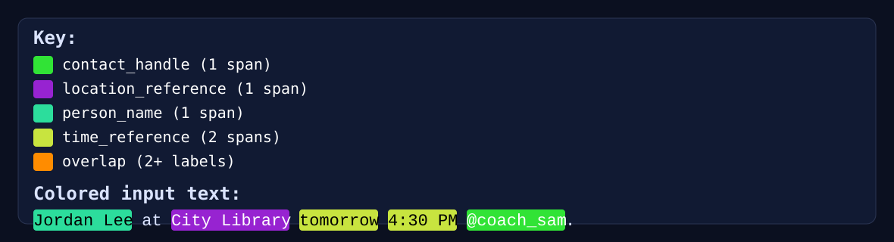

# NER Labeler Example

**If you're here from Khan, thanks so much. The codes, not great, I just figured I'd through something up so the concept is (slightly) more clear?**

## Description

Essentially, what we want is to use live inferenced data to generate structured training data for a downstream NER model. This example shows how to use `ts-agent-lib` to build a scaffold for this workflow, with:

`npm run example:ner -- "Jordan Lee at City Library tomorrow 4:30 PM @coach_sam."`



```json
{
  "type": "step_completed",
  "executionId": "9b2bbf73-a9d9-4a1d-8910-2445beb252df",
  "ts": "2026-03-01T00:24:20.178Z",
  "stepId": "merge_entity_labels",
  "runInputText": "Jordan Lee at City Library tomorrow 4:30 PM @coach_sam.",
  "stepTelemetry": {
    "stepId": "merge_entity_labels",
    "action": "merge_entity_labels",
    "input": {
      "inputText": "Jordan Lee at City Library tomorrow 4:30 PM @coach_sam.",
      "dependencyStepIds": [
        "extract:contact_handle",
        "extract:location_reference",
        "extract:person_name",
        "extract:time_reference"
      ],
      "dependenciesByLabel": {
        "contact_handle": {
          "label": "contact_handle",
          "matches": [
            "@coach_sam"
          ],
          "confidence": 0.92
        },
        "location_reference": {
          "label": "location_reference",
          "matches": [
            "at City Library"
          ],
          "confidence": 0.92
        },
        "person_name": {
          "label": "person_name",
          "matches": [
            "Jordan Lee"
          ],
          "confidence": 0.92
        },
        "time_reference": {
          "label": "time_reference",
          "matches": [
            "tomorrow",
            "4:30 PM"
          ],
          "confidence": 0.9
        }
      }
    },
    "output": {
      "inputText": "Jordan Lee at City Library tomorrow 4:30 PM @coach_sam.",
      "entities": {
        "contact_handle": {
          "label": "contact_handle",
          "confidence": 0.92,
          "spans": [
            {
              "text": "@coach_sam",
              "start": 44,
              "end": 54
            }
          ]
        },
        "location_reference": {
          "label": "location_reference",
          "confidence": 0.92,
          "spans": [
            {
              "text": "at City Library",
              "start": 11,
              "end": 26
            }
          ]
        },
        "person_name": {
          "label": "person_name",
          "confidence": 0.92,
          "spans": [
            {
              "text": "Jordan Lee",
              "start": 0,
              "end": 10
            }
          ]
        },
        "time_reference": {
          "label": "time_reference",
          "confidence": 0.9,
          "spans": [
            {
              "text": "tomorrow",
              "start": 27,
              "end": 35
            },
            {
              "text": "4:30 PM",
              "start": 36,
              "end": 43
            }
          ]
        }
      }
    }
  }
}
```

## Run (no build step)

1. Install dependencies once:

```bash
npm install
```

2. Create local env file:

```bash
cp examples/ner-labeler/.env.example examples/ner-labeler/.env
```

3. Edit `examples/ner-labeler/.env` and set `OPENAI_API_KEY`.

4. Run with required input text:

```bash
npm run example:ner -- "Jordan Lee at City Library tomorrow 4:30 PM @coach_sam."
```

Or run directly from the workspace package:

```bash
npm run --workspace @ts-agent-lib/example-ner-labeler dev -- "Jordan Lee at City Library tomorrow 4:30 PM @coach_sam."
```

## Required input contract

- Exactly one text argument is required.

## Output contract

For each label step, the model returns:

- `matches`: exact substrings from input text, or `["none"]`
- `confidence`: `0.0` to `1.0`

`merge_entity_labels` then converts matches into regex-based NER spans over the input text.
The final merged `TrainingRecord` is keyed by label name and each label contains:

- `label`
- `confidence`
- `spans`: `[{ text, start, end }]` where `start` and `end` are character indexes in `inputText`

## Output files

- event telemetry: `examples/ner-labeler/output/events.ndjson`

`events.ndjson` is enriched per event with:

- `runInputText`: original input text passed to the run
- `stepTelemetry` on step events:
  - `input` (model/system prompt/user prompt/schema for extract steps; dependency inputs for merge step)
  - `output` (raw extraction result or final merged `TrainingRecord`)
  - `error` (if the step failed before producing output)
- `stepTelemetryById` on execution completion/cancellation for full-run step I/O summary